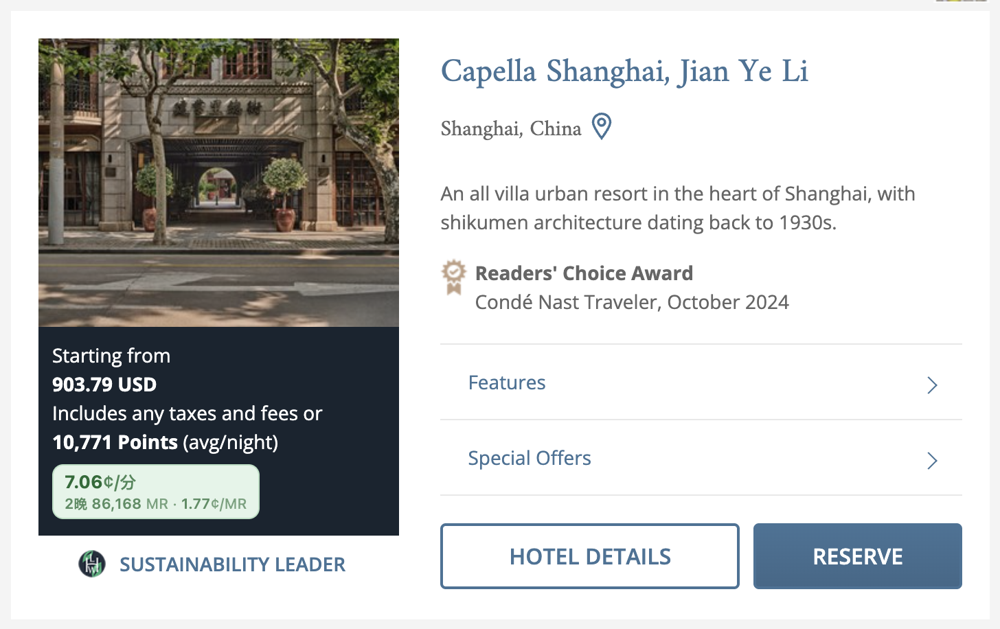
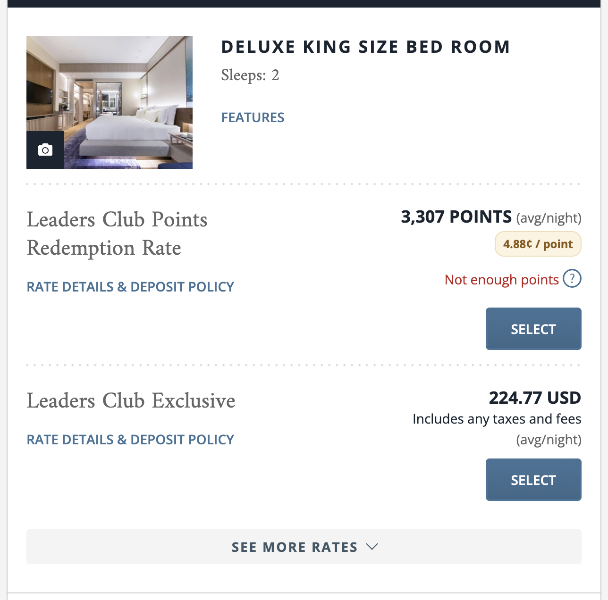

# LHW Award Helper

给 [lhw.com](https://www.lhw.com)（Leading Hotels of the World / Leaders Club）加两个东西：

1. **解除积分不足的置灰** —— 积分余额不够时，积分兑换房的 `Select` 按钮会被禁用，看不到也点不了。脚本移除该限制。
2. **就地显示 CPP（Cents per point）** —— 在城市搜索页的每家酒店、房型页的每个积分房价旁，直接标出每积分价值多少美分，并按 Amex 1:4 换算所需 MR 积分。

搜索页 —— 每家酒店的价格框内显示 CPP：



房型页 —— 每个积分房价旁显示 CPP，置灰的 `Select` 已恢复可用：



悬停徽章可看到完整推导：

```
2 晚合计
最便宜现金价：410.68 USD（Prepay and Save min 2 nights stay）
积分房税费：87.79 USD
LHW 积分：6,614
Amex 1:4 → 26,456 分
CPP = (410.68 − 87.79) ÷ 6,614 × 100
    = 4.882¢ / LHW　=　1.220¢ / Amex
```

## 安装

两种形式二选一。油猴脚本自动运行，bookmarklet 需要手动点一下但不用装扩展。

### 油猴脚本（推荐）

装好 [Tampermonkey](https://www.tampermonkey.net/) 后，点击安装：

**[dist/lhw-award-helper.user.js](../../raw/main/dist/lhw-award-helper.user.js)**

脚本带 `@updateURL`，之后 Tampermonkey 会自动检查更新。

### Bookmarklet

打开安装页 **<https://hmumixam.github.io/lhw-award-helper/dist/install.html>**，把页面上的按钮拖到书签栏。

拖不动的话（部分浏览器禁止拖拽 `javascript:` 链接），手动新建书签，把 [dist/bookmarklet.txt](dist/bookmarklet.txt) 的全部内容粘贴到「网址」栏。

用法：在 lhw.com 的搜索页或房型页点一下这个书签。重复点击安全，不会重复插入。

## CPP 怎么算的

```
CPP = (同房型最便宜现金价总额 − 积分房现金支出) / 积分数 × 100
```

「积分房现金支出」是选积分房时仍需付现的税费。所以 CPP 衡量的是**每消耗 1 点积分，替你省下多少美分现金**。

基准取的是最便宜的现金房价，**不区分可退性**。实际上它经常是预付不可退的房价（如 `Prepay and Save`、`Advance Purchase`），这会系统性压低 CPP。徽章 tooltip 里会写明具体用了哪个房价作基准。

### 两个页面的数据来源不同

| | 房型页 `/select-room` | 搜索页 `/property-search` |
|---|---|---|
| 现金基准 | 同房型最便宜房价 | 全店最低房价 |
| 精度 | 精确到房型 | 全店概览 |

搜索页的最低现金价与最低积分价**可能来自不同房型**，所以那里的数值是酒店级近似。实测两家上海酒店，搜索页与房型页算出的 CPP 完全一致（4.882¢ / 7.064¢），但不保证所有酒店都如此。

### 一个容易算错的地方

搜索页 API 返回的三个字段基准并不统一：

- `AvgMinPricePerNight` —— **每晚**
- `AvgMinPointsPerNight` —— **每晚**
- `Taxes[].AmountVal` —— **整段住期总额**

直接相减会低估 CPP。2 晚的例子：正确值 4.882¢，不做换算会算成 3.554¢，差了 27%。代码里先把价格和积分乘以晚数再减税费。

## 配置

改 `src/core.js` 顶部（或油猴脚本里对应位置）：

```js
const CONFIG = {
    amexRatio: 4,       // 4 Amex MR = 1 LHW point，转让比例变了改这里
    good: 5.0,          // ≥5¢ 绿色
    ok: 3.0,            // ≥3¢ 橙色，以下灰色
    hideWarning: false, // true 则隐藏 "Not enough points" 文字
};
```

## 注意事项

- **脚本只拆掉前端的那道闸。** 点击后本地能正常记账、进到下一步，但最终提交预订时服务端会独立校验积分余额，余额不足大概率仍会被拒。它更适合用来看清哪些房型开放了积分兑换、各自要多少分、值不值。
- 不碰 `CONTINUE` 按钮。那个按钮的禁用来自「还没选房」和「提交中防重复点击」，与积分无关，动它会破坏防重复提交的保护。
- 站点是 Vue 2 应用，页面结构变了脚本可能失效。

## 开发

```bash
npm install
npm run build
```

`src/core.js` 是唯一的源文件，`scripts/build.mjs` 从它生成 `dist/` 下的三个产物：油猴脚本（保持可读）、bookmarklet（terser 压缩后 URI 编码）、以及安装页。

## License

MIT
