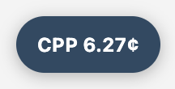
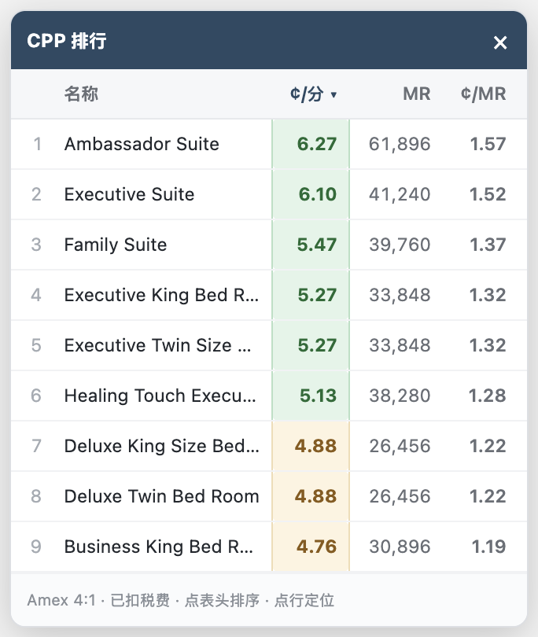
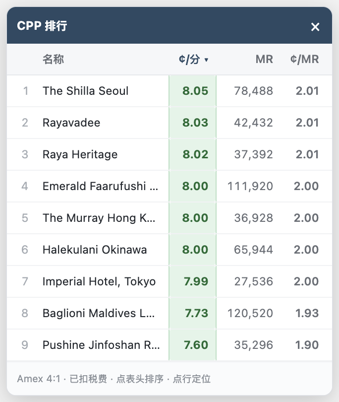

# LHW Award Helper

给 [lhw.com](https://www.lhw.com)（Leading Hotels of the World / Leaders Club）加四个东西：

1. **解除积分不足的置灰** —— 积分余额不够时，积分兑换房的 `Select` 按钮会被禁用，看不到也点不了。脚本移除该限制。
2. **就地显示 CPP（Cents per point）** —— 在城市搜索页的每家酒店、房型页的每个积分房价旁，标出每积分值多少美分，并按 Amex 4:1 一并给出需要多少 MR、折合每 MR 多少美分。
3. **右下角 CPP 排行面板** —— 把当前页所有积分房排个序，可按 CPP 或所需 Amex 积分排。点一行就跳到页面上对应的酒店。默认收起成一个小按钮，点开才显示。
4. **搜索页自动补全全部房价** —— 不用一路往下滚，搜索结果里每家酒店的价格都会在后台悄悄取回来，排行榜一开始就是完整的。

搜索页 —— 每家酒店的价格框内：


房型页 —— 每个积分房价旁，置灰的 `Select` 已恢复可用：


徽章分两行。主行是 LHW 每分价值，副行是转点视角：这段住期一共要转多少 MR、折合每 MR 值多少美分。**副行是整段住期合计**，因为 LHW 页面上那个大号积分数是 `avg/night`，两者口径不同，所以多于一晚时会显式标出晚数（如 `2晚`）。

面板默认收在右下角，只是一个小按钮，上面直接写着当前页最好的 CPP：



点开是完整排行：



默认按 CPP 降序。**点表头可以换一种排法**，再点同一列反向：

| 表头 | 排序依据 | 首次点击方向 |
|---|---|---|
| `¢/分` | LHW 每分价值 | 从高到低 |
| `MR` | 这段住期需要转多少 Amex 分 | 从低到高 |
| `¢/MR` | 折算后每 MR 价值 | 从高到低 |

按 `MR` 排是为了回答另一个问题：手上的分够换哪些。它和 CPP 的顺序常常不一致——上图里 Healing Touch 的 CPP（5.13¢）低于 Executive（5.27¢），需要的积分反而更多（38,280 vs 33,848）。

`¢/MR` 与 `¢/分` 的排序结果必然相同（只差一个固定倍率），单独列出只是方便你直接盯着转点后的数字看。

点任意一行会跳到页面上对应的房型或酒店并高亮一下。展开状态与排序方式都记在 `localStorage`，下次沿用。

## 搜索页不用再一路滚到底

搜到一整片区域（比如 Asia）时，LHW 的结果是挤牙膏式出来的：酒店列表其实一次就下发完了，但**每家的价格要等卡片滚进视野才去请求**，所以不翻到底就凑不齐一张完整的排行榜。

脚本直接向页面自己的 store 派发取价请求，把缺的补齐，**全程不动滚动条**，页面不会在你眼皮底下乱跳。同时并发限制在 4 个，每家只请求一次。补的过程中收起态按钮会显示进度（如 `CPP 8.05¢ · 32/50`），补完就变回单纯的最佳 CPP。

于是一个 50 家酒店的区域搜索，排行榜几秒内就是完整的 40 家有积分房的结果：



这里也能看出按 `MR` 排序的用处：第 4 名要 111,920 MR，而第 7 名 CPP 几乎一样（7.99¢ vs 8.00¢）却只要 27,536 MR。

另外 LHW 默认只「显示」前 10 张卡片（滚动才 +10），被藏起来的是 `display: none`，浏览器根本没给它排版位置。所以点排行榜里那些还没露面的酒店时，脚本会先按页面自己的方式把它放出来，再滚过去——不然点了会毫无反应。

悬停徽章可看到完整推导：

```
2 晚合计
最便宜现金价：410.68 USD（Prepay and Save min 2 nights stay）
积分房税费：87.79 USD
LHW 积分：6,614
Amex 1:4 → 26,456 MR
CPP = (410.68 − 87.79) ÷ 6,614 × 100
    = 4.882¢ / LHW 分　=　1.220¢ / Amex MR
```

## 安装

两种形式二选一。油猴脚本自动运行，bookmarklet 需要手动点一下但不用装扩展。

### 油猴脚本（推荐）

装好 [Tampermonkey](https://www.tampermonkey.net/) 后，点击安装：

**[dist/lhw-award-helper.user.js](../../raw/main/dist/lhw-award-helper.user.js)**

脚本带 `@updateURL`，之后 Tampermonkey 会自动检查更新。

### Bookmarklet

打开安装页 **<https://hmumixam.github.io/lhw-award-helper/dist/install.html>**，把页面上的按钮拖到书签栏。

拖不动的话（部分浏览器禁止拖拽 `javascript:` 链接），手动新建书签，把 [dist/bookmarklet.txt](dist/bookmarklet.txt) 的全部内容粘贴到「网址」栏。

用法：在 lhw.com 的搜索页或房型页点一下这个书签。重复点击安全，不会重复插入。

## CPP 怎么算的

```
CPP = (同房型最便宜现金价总额 − 积分房现金支出) / 积分数 × 100
```

「积分房现金支出」是选积分房时仍需付现的税费。所以 CPP 衡量的是**每消耗 1 点积分，替你省下多少美分现金**。

基准取的是最便宜的现金房价，**不区分可退性**。实际上它经常是预付不可退的房价（如 `Prepay and Save`、`Advance Purchase`），这会系统性压低 CPP。徽章 tooltip 里会写明具体用了哪个房价作基准。

### 两个页面的数据来源不同

| | 房型页 `/select-room` | 搜索页 `/property-search` |
|---|---|---|
| 现金基准 | 同房型最便宜房价 | 全店最低房价 |
| 精度 | 精确到房型 | 全店概览 |

搜索页的最低现金价与最低积分价**可能来自不同房型**，所以那里的数值是酒店级近似。实测两家上海酒店，搜索页与房型页算出的 CPP 完全一致（4.882¢ / 7.064¢），但不保证所有酒店都如此。

### 一个容易算错的地方

搜索页 API 返回的三个字段基准并不统一：

- `AvgMinPricePerNight` —— **每晚**
- `AvgMinPointsPerNight` —— **每晚**
- `Taxes[].AmountVal` —— **整段住期总额**

直接相减会低估 CPP。2 晚的例子：正确值 4.882¢，不做换算会算成 3.554¢，差了 27%。代码里先把价格和积分乘以晚数再减税费。

## 配置

改 `src/core.js` 顶部（或油猴脚本里对应位置）：

```js
const CONFIG = {
    amexRatio: 4,       // 4 Amex MR = 1 LHW point，转让比例变了改这里
    good: 5.0,          // ≥5¢ 绿色
    ok: 3.0,            // ≥3¢ 橙色，以下灰色
    hideWarning: false, // true 则隐藏 "Not enough points" 文字
    panel: true,        // false 则不显示右下角排行面板
    prefetch: true,     // false 则不在搜索页后台补全房价（改回滚到哪算哪）
};
```

配色阈值 `good` / `ok` 按的是 **LHW 每分价值**。如果你更关心「这些 MR 转过去划不划算」，注意换算：4:1 之下 5¢ 的 LHW 分只等于 1.25¢ 的 MR，未必打得过你自己对 MR 的估值。想让绿色代表「MR 视角也划算」，把阈值按 `amexRatio` 放大即可，比如 `good: 8.0`（= 2¢/MR）、`ok: 6.0`（= 1.5¢/MR）。

## 注意事项

- **脚本只拆掉前端的那道闸。** 点击后本地能正常记账、进到下一步，但最终提交预订时服务端会独立校验积分余额，余额不足大概率仍会被拒。它更适合用来看清哪些房型开放了积分兑换、各自要多少分、值不值。
- 不碰 `CONTINUE` 按钮。那个按钮的禁用来自「还没选房」和「提交中防重复点击」，与积分无关，动它会破坏防重复提交的保护。
- 站点是 Vue 2 应用，页面结构变了脚本可能失效。
- 补全房价用的是页面自己的取价接口，只是把「滚到才取」提前成「一开始就取」，请求总数和你手动滚到底是一样的。搜索范围特别大时会一次性多发几十个请求，介意就把 `prefetch` 关掉。

## 开发

```bash
npm install
npm run build
```

`src/core.js` 是唯一的源文件，`scripts/build.mjs` 从它生成 `dist/` 下的三个产物：油猴脚本（保持可读）、bookmarklet（terser 压缩后 URI 编码）、以及安装页。

## License

MIT
